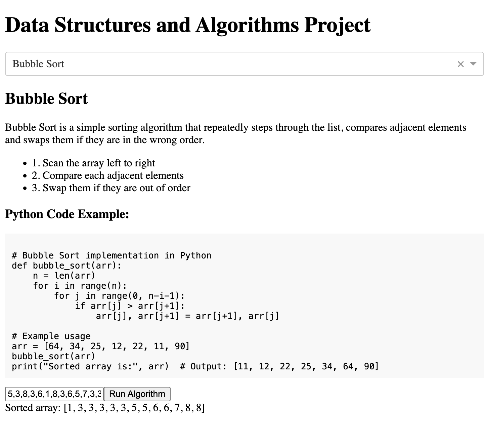

# Dash DSA Project

This project was created to help me better study for my Data Structures and Algorithms exam. You can select whatever algorithm you wish and see information about how the algorithms works, it's implmentation in Python and also an interactive element to run the sorting algorithms on you array input! 

## Deployed live here: https://sortingalgorithms-29c8e547cc98.herokuapp.com/

The algorithms you can chose from are as follows:
- Bubble Sort
- Selection Sort
- Insertion Sort
- Shell Sort
- Radix Sort
- Merge Sort
- Quick Sort

You can also see algorithm examples for traversing through tree structures, and how to do it in Python:

- DFS
- BFS




## To run the project locally:

--------------------------------
1. clone the repo
2. cd into the repo:

```
cd DSA
```
3. install dependencies
```
pip install -r requirements.txt
```
4. Run the project on localhost
```
python app.py
```